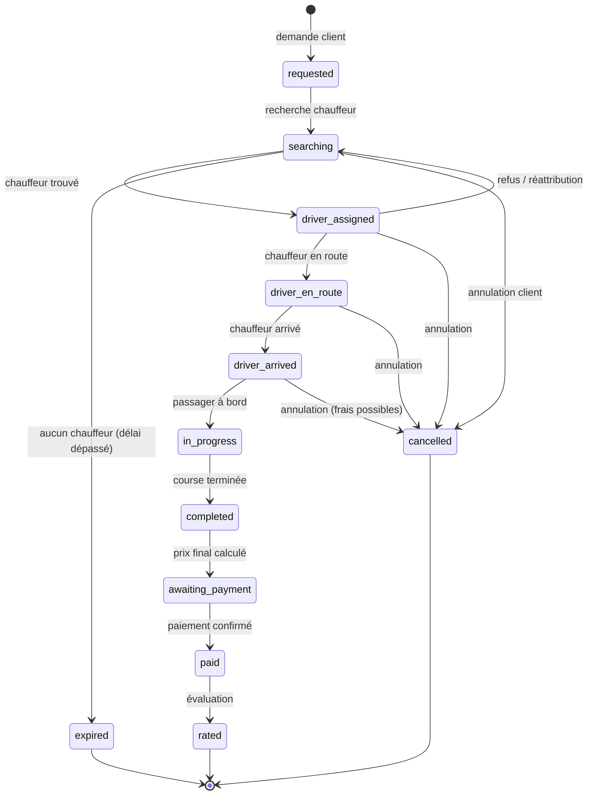

# Cycle de vie d'une course

> Répond aux §6 et §19 du cahier des charges.

## 1. Machine à états

Le cahier des charges décrit la suite : demande → recherche chauffeur → chauffeur
trouvé → chauffeur en route → chauffeur arrivé → passager à bord → course en cours →
course terminée → paiement → évaluation.

Elle est implémentée telle quelle dans `apps/api/src/domain/ride-state.ts`, avec les
états d'échec que toute exploitation réelle impose (annulation, expiration).



**Toute transition est enregistrée côté serveur** dans `ride_events` avec l'auteur
(client, chauffeur, administrateur ou système), l'horodatage, la position au moment
du changement et un contexte JSON. C'est l'exigence explicite du §6 : suivi, audit et
gestion des litiges.

## 2. Qui a le droit de déclencher quoi

| Transition | Client | Chauffeur | Admin | Système |
|---|:--:|:--:|:--:|:--:|
| `requested → searching` | | | | ✔ |
| `searching → driver_assigned` | | ✔ (acceptation) | | ✔ |
| `searching → expired` | | | | ✔ |
| `driver_assigned → driver_en_route` | | ✔ | | |
| `driver_en_route → driver_arrived` | | ✔ | | |
| `driver_arrived → in_progress` | | ✔ | | |
| `in_progress → completed` | | ✔ | | |
| `completed → awaiting_payment` | | | | ✔ |
| `awaiting_payment → paid` | | ✔ (espèces) | ✔ | ✔ (prestataire) |
| `paid → rated` | ✔ | | | |
| `* → cancelled` | ✔ | ✔ | ✔ | |

Les droits sont vérifiés dans `domain/ride-state.ts` (`canTransition`) puis appliqués
en transaction par `services/rides.ts`. Une transition interdite renvoie `409` et
n'écrit rien.

## 3. Attribution des courses (§19)

```
1. La course passe en `searching`.
2. Recherche des chauffeurs candidats :
   - statut en ligne, non occupés, compte validé et non suspendu ;
   - catégorie de véhicule demandée ;
   - position connue de moins de 2 minutes ;
   - dans un rayon configurable (DISPATCH_SEARCH_RADIUS_KM, 5 km par défaut).
3. Classement (domain/dispatch.ts), score composite configurable :
   - distance au point de départ (poids fort) ;
   - temps estimé d'arrivée ;
   - note moyenne du chauffeur ;
   - taux d'acceptation récent.
4. Offre séquentielle : le premier candidat reçoit l'offre, valable
   DISPATCH_OFFER_TTL_SECONDS (20 s par défaut).
   - acceptation → `driver_assigned`, les autres offres sont annulées ;
   - refus ou expiration → offre au candidat suivant ;
   - liste épuisée → nouvelle recherche élargie, puis `expired`.
5. Chaque offre est tracée dans `ride_offers` (proposée / acceptée / refusée /
   expirée) : c'est la source du KPI « taux d'acceptation » (§24).
```

Le classement est une fonction pure : changer de stratégie (round-robin, priorité aux
chauffeurs les moins servis, zones à forte demande) revient à changer une fonction de
score, sans toucher au reste.

## 4. Du prix estimé au prix final

| Moment | Ce qui est calculé | Stocké dans |
|---|---|---|
| Avant commande | Estimation à partir de la distance et de la durée prévues | `rides.estimated_fare` |
| Fin de course | Prix final à partir de la distance et de la durée **réelles** | `rides.final_fare` |
| Fin de course | Remise promotionnelle éventuelle | `rides.discount_amount` |
| Fin de course | Commission plateforme / part chauffeur | `rides.platform_amount`, `rides.driver_amount` |

Les tarifs appliqués sont figés sur la course (`rides.pricing_rule_id` + copie des
paramètres) : une modification de grille tarifaire en administration ne réécrit jamais
l'historique ni les montants déjà facturés.

## 5. Annulations

- Avant `driver_arrived` : gratuite par défaut.
- Après `driver_arrived` : frais d'annulation configurables par grille tarifaire
  (`cancellation_fee`), facturés au client et reversés au chauffeur, commission
  déduite selon les mêmes règles qu'une course.
- Toute annulation enregistre son auteur et son motif — matière première de la
  gestion des litiges (§15).
